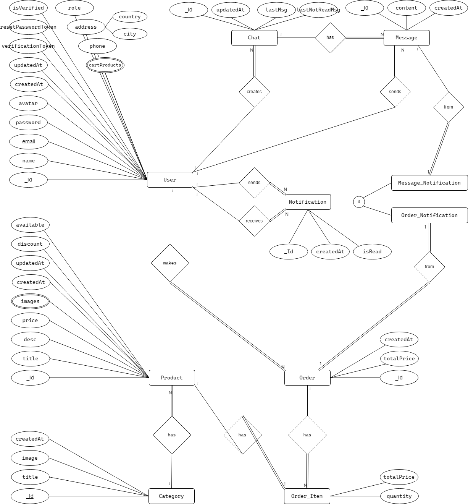

# NestMart

NestMart is an e-commerce web application designed to market our company products and provide customers with the flexibility to browse and purchase items online.

## Table of Contents
- [ERD](#erd)
- [Project Overview](#project-overview)
- [Features](#features)
- [Technologies Used](#technologies-used)
- [API Documentation](#api-documentation)
- [Installation](#installation)
- [Conclusion](#conclusion)

## ERD
The next entity-relationship diagram (ERD) illustrates the database schema for NestMart. It includes entities such as Users, Categories, Products, Carts, Orders, Chats, and Notifications, all interconnected to support the app's core functionalities.




## Project Overview
NestMart is built to facilitate seamless online shopping experiences for customers. The application supports product browsing, cart management, order processing, real-time chat, notifications and admin dashboard.

## Features

### Authentication and Authorization
- **Registration**: Users can register with their email, password, and name.
- **Email Verification**: A verification email is sent post-registration.
- **Login**: Users can log in with their email and password.
- **Password Reset**: Forgot password functionality is available.
- **JWT Authentication**: Secures the application with JSON Web Tokens (JWT).

### User Account Management
- **Profile Management**: Users can update their profile details and upload an avatar.
- **Account Settings**: Users can manage their account settings and delete their account if needed.

### Product and Category Management
- **Product Search**: Users can search for products.
- **Category Pages**: Products are organized into categories for easier browsing.
- **Admin Controls**: Admins can create, update, and delete categories and products.

### Cart and Orders
- **Cart Management**: Users can add and remove items from their cart.
- **Order Processing**: Users can place orders based on the items in their cart.

### Chat and Notifications
- **Admin Chat**: Real-time chat support is available with admins for customer inquiries.
- **Notifications**: Users receive notifications for messages and order updates.

### Payment and Shipment
- **Future Enhancement**: Payment and shipment features will be added in upcoming versions.

## Technologies Used
- **Frontend**: HTML, CSS, JavaScript, TypeScript, React.js, Tailwind CSS
- **Backend**: Node.js, TypeScript, Express.js
- **Database**: SQLite
- **Real-time Communication**: Socket.IO for chat and notifications
- **Authentication**: JWT (JSON Web Tokens)

## API Documentation

### Auth
```
post: /auth/register
post: /auth/login
get: /auth/refresh
get: /auth/logout
get: /auth/verifyAccount
post: /auth/forgetPassword
get: /auth/resetPassword
post: /auth/resetPassword
```

### Users
```
get: /users
get: /users/search
get: /users/userId
patch: /users/userId
delete: /users/userId
```

### Categories
```
get: /categories
get: /categories/search
post: /categories
get: /categories/categoryId
patch: /categories/categoryId
delete: /categories/categoryId
get: /categories/categoryId/products
```

### Products
```
get: /products
get: /products/search
post: /products
get: /products/productId
patch: /products/productId
delete: /products/productId
```

### Orders
```
get: /orders
post: /orders
get: /orders/all
get: /orders/orderId
delete: /orders/orderId
```

### Carts
```
get: /cart
post: /cart/productId
delete: /cart/productId
```

### Notifications
```
get: /notifications
patch: /notifications/notificationId
delete: /notifications/notificationId
```

### Chats
```
Get chats and create new chat:
  get: /chats
  post: /chats
Get, update and delete chat:
  get: /chats/chatId
  patch: /chats/chatId
  delete: /chats/chatId
Get chat messages and create new message:
  get: /chats/chatId/messages
  post: /chats/chatId/messages
Delete message:
  delete: /chats/chatId/messages/messageId
```

## Installation

### Prerequisites
- **Node.js**: Ensure you have Node.js installed.

### Steps

1. **Clone the repository:**
    ```
    git clone https://github.com/ShirefMohammed/NestMart/
    ```

2. **Handle server:**
    ```
    cd server
    npm install
    ```

    Create a .env file in the root of the server directory with the following content:
    ```
    ACCESS_TOKEN_SECRET=ACCESS_TOKEN_SECRET
    REFRESH_TOKEN_SECRET=REFRESH_TOKEN_SECRET
    VERIFICATION_TOKEN_SECRET=VERIFICATION_TOKEN_SECRET
    RESETPASSWORD_TOKEN_SECRET=RESETPASSWORD_TOKEN_SECRET
    SERVER_URL=http://localhost:3000
    NODE_ENV=development
    PORT=3000
    DATABASE_NAME=sqlite_database.db
    EMAIL_SERVICE_USER=your email
    EMAIL_SERVICE_PASSWORD=your email service password
    ```

    ```
    npm run dev
    or
    npm start
    ```

    Navigate to http://localhost:3000 in your browser.

3. Handle client:
    ```
    cd client
    npm install
    ```

    Create a .env.local file in the root of the client directory with the following content:
    ```
    VITE_SERVER_URL=http://localhost:3000
    VITE_NODE_ENV=development
    ```

    ```
    npm run dev
    or
    npm start
    ```

    Navigate to http://localhost:5173/ in your browser.

## Conclusion
NestMart is designed to provide a comprehensive and flexible e-commerce solution. With features for user management, product browsing, order processing, and real-time communication, it offers a robust platform for online shopping. We welcome contributions and feedback to enhance the platform further. For any issues or suggestions, feel free to reach out or submit a pull request on GitHub.
